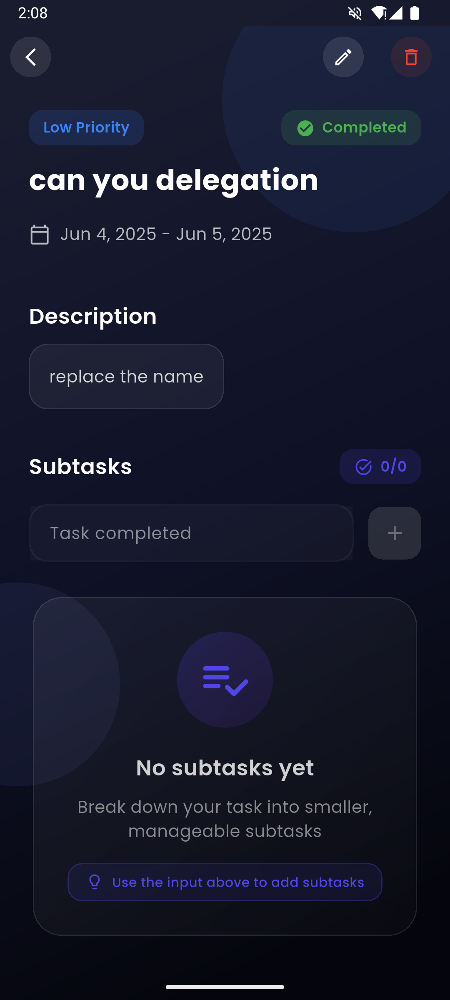

# Task Day - Modern Task Management App

A beautiful and feature-rich task management application built with Flutter, designed to help you organize your tasks efficiently with a modern and intuitive interface.

## Screenshots

### Main Features





*Create new task interface with priority selection*


*Subtask management with progress tracking*

## Features

### Task Management
- Create, edit, and delete tasks
- Set task priorities (Low, Medium, High)
- Add detailed descriptions to tasks
- Set start and end dates for tasks
- Mark tasks as complete/incomplete
- Beautiful task cards with priority indicators
- Task filtering and organization

### Subtask System
- Break down tasks into smaller, manageable subtasks
- Add, edit, and delete subtasks
- Track subtask completion status
- Visual progress tracking with progress bar
- Percentage completion indicator

### User Interface
- Modern and clean design
- Dark theme optimized for eye comfort
- Responsive layout using ScreenUtil
- Smooth animations and transitions
- Intuitive navigation using go_router
- Beautiful typography with Google Fonts

### Data Management
- Local storage using Hive database
- Persistent data across app restarts
- Efficient state management with BLoC pattern
- Real-time updates and synchronization

## Getting Started

### Prerequisites
- Flutter SDK (latest stable version)
- Dart SDK (latest stable version)
- Android Studio / VS Code with Flutter extensions

### Installation

1. Clone the repository:
```bash
git clone https://github.com/yourusername/task_day.git
```

2. Navigate to the project directory:
```bash
cd task_day
```

3. Install dependencies:
```bash
flutter pub get
```

4. Run the app:
```bash
flutter run
```

## Dependencies

- `flutter_bloc`: For state management
- `go_router`: For navigation
- `hive`: For local storage
- `flutter_screenutil`: For responsive UI
- `google_fonts`: For custom typography
- `intl`: For date formatting
- `equatable`: For value equality

## Architecture

The app follows a clean architecture pattern with the following structure:

- `lib/`
  - `controller/`: BLoC state management
  - `core/`: Core utilities and configurations
  - `models/`: Data models
  - `services/`: Business logic and services
  - `view/`: UI components and screens

## Contributing

Contributions are welcome! Please feel free to submit a Pull Request.

## License

This project is licensed under the MIT License - see the LICENSE file for details.

## Acknowledgments

- Flutter team for the amazing framework
- All the package authors that made this possible
